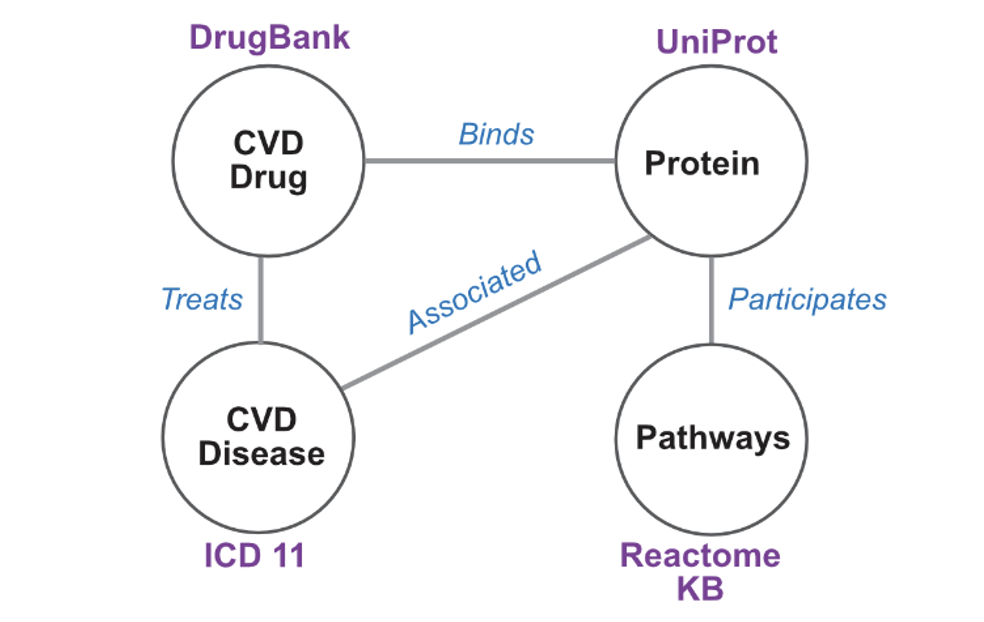

## Ping Lab Intern Project, Summar, 2022

### Title: 
***Link prediction through Graph Neural Network (GNN) model over the Knowledgegraph in the interface of Cardiovascular Disease (CVD) and Oxidative Stress (OS)***.

### Description: 
This project includes the development of a Graph Neural Network (GNN) model with a knowledge graph in the interface of Cardiovascular Diseases (CVD) and Oxidative Stress (OS). The previous project on "Building Knowledgegraph in the interface of the Cardiovascular Diseases and Oxidative Stress" has sufficiently provided the data and data schema for building heterogeneous graph representation. One needs to convert the knowledge graph into graph embedding so that it can be used for the Graph Neural Network model. In general, GNN offers three different prediction models: (1) node prediction, (2) link prediction, and (3) graph classification. We are particularly interested in building the model for 'link prediction' between CVD and OS terms.

#### Heterograph Convolution



Heterograph convolution is designed by combining the individual relationship model.

```
conv = HeteroConv({
          ('paper', 'mentions', 'protein'): GCNConv(-1, hidden_channels),
          ('paper', 'assigns', 'MeSH'): SAGEConv((-1, -1), hidden_channels),
          ('protein', 'candidate', 'pathways'): GATConv((-1, -1), hidden_channels),
          ('protein', 'associated', 'drug'): GATConv((-1, -1), hidden_channels),
          }, aggr='sum')
```

### Project Walkthrough:
1. Understand the schema, data content, and development of the knowledge graph in the interface of Cardiovascular Disease and Oxidative Stress from the previous project.
2. Learn more about graph embedding functionality in Neo4j GDS library and DGL-KE library
3. Learn more about the fundamentals of machine learning models ( e.g., allocating data for training, validation, and test, selecting proper GNN message passing algorithm, selecting optimizer, Cost function, accuracy metric, and inferences)
4. Explore about homogeneous Graph Neural Network with provided tutorial-1
5. Explore heterogeneous Graph Neural Networks with provided tutorial-2
6. Develop the graph embedding for the OS-CVD heterogeneous knowledge graph.
7. Prepare the training, validation, and testing by masking the nodes or edges.
8. Train the model with tuning hyperparameters and interpret the performance.
9. Implement the model for link prediction and analyze it with biomedical findings.

### Educational Goal: 
This project offers the wonderful opportunity to learn and build cutting-edge machine learning models in graph data. Participants will get hands-on experience with GNN and KG libraries (e.g.,  Neo4j, DGL, and Pytorch Geometric). 

### Scientific Goal:
Understanding the role of OS in Cardiovascular Disease through a molecular mechanism associated with ion-channel proteins is the core of the scientific goal of the project. Prediction of the possible links between OS and CVD terms based on KG built through text mining of millions of documents opens a new research horizon. Newly predicted associations could provide further insight into the molecular mechanism and disease pathogenesis.

### References
1. [Learning HeteroGraph Pytorch Gemometric](https://pytorch-geometric.readthedocs.io/en/latest/notes/heterogeneous.html)
2. [Introduction to Knowledge Graph Embedding](https://aws-dglke.readthedocs.io/en/latest/kg.html#a-short-explanation-of-the-score-functions)
3. [Graph Embedding in Neo4j](https://neo4j.com/developer/graph-data-science/graph-embeddings/)

